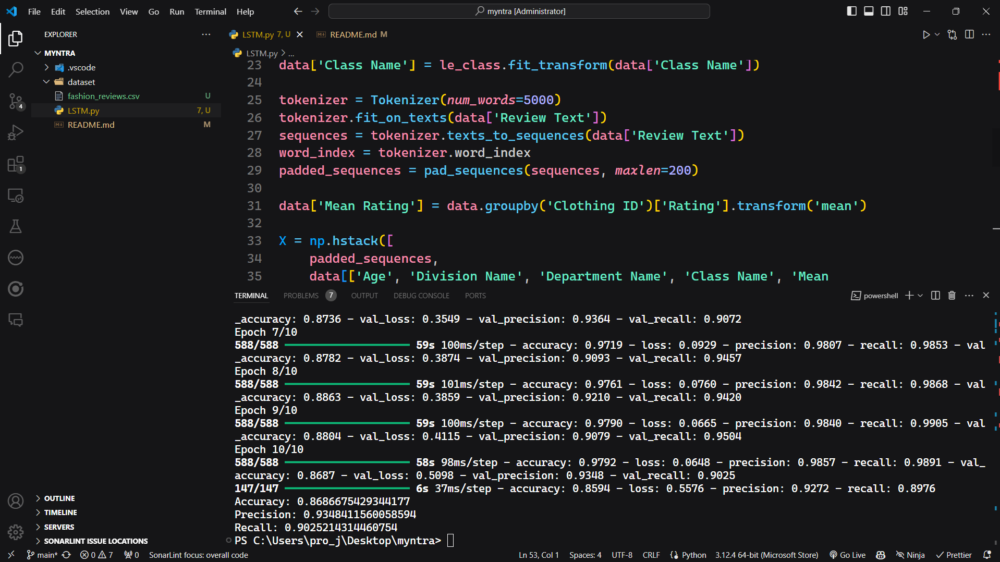
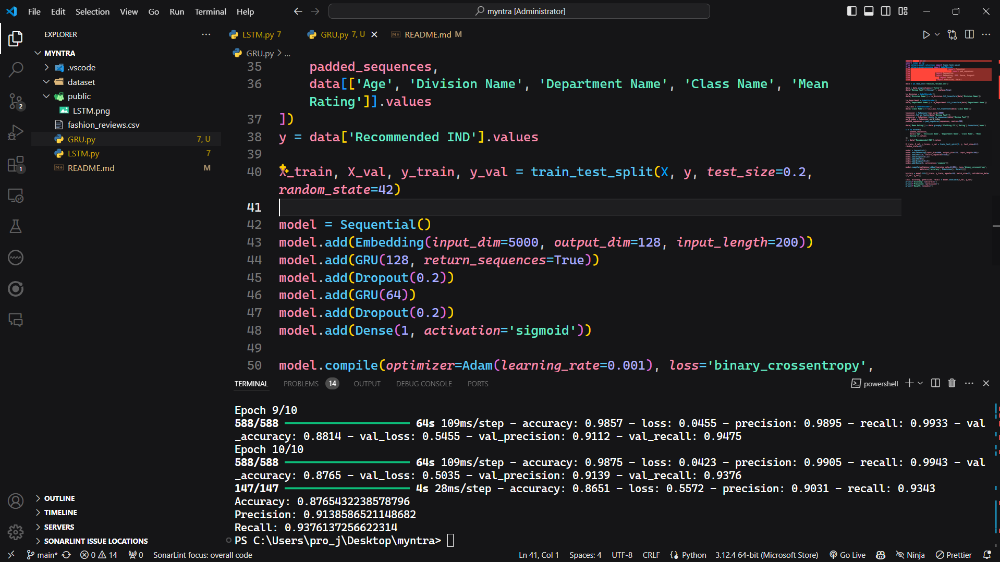

Problem statement: Employ AI-driven recommendation system that analyze current fashion trends, customer preferences, and purchase history to deliver tailored product
suggestions, enhancing customer engagement and conversion rates in the fast fashion segment.

The dataset for this problem statement is available at: https://www.kaggle.com/nicapotato/womens-ecommerce-clothing-reviews

Run following commands:
1. pip install pandas scikit-learn tensorflow

The results of model are as follows:
- LSTM: the screenshot of the result is:

- GRU: the screenshot of the result is:
